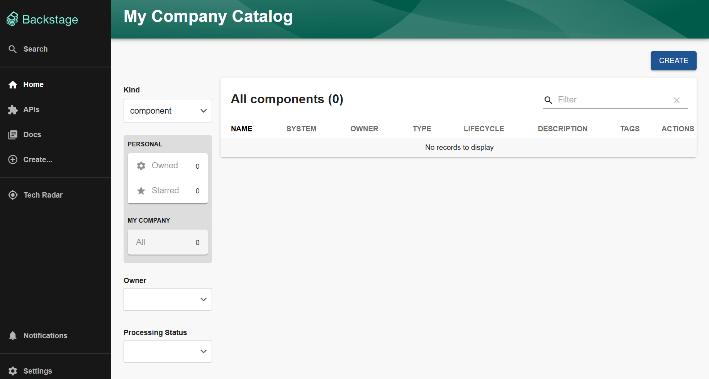

# Quick Start

chocott-backstageをすぐに起動して試すための手順です。

## 前提条件

- macOS、またはWindows（WSL2のUbuntu等）などのLinux環境で作業していること
- GitHubアカウント（パーソナルアカウント、またはOrganization（組織）アカウント）を持っていること
- Dockerがインストールされていること

## 手順

### 1. コードのclone

本リポジトリをcloneしてください。

```shell
git clone https://github.com/ap-communications/chocott-backstage.git --depth 1
cd chocott-backstage
```

### 2. GitHub Appの登録

BackstageのGitHub連携にはGitHub Appの登録が必要です。
[GitHub App登録手順](./chocott-contents/docs/authentication/githubapp/index.md)を参照し、GitHubアカウントにGitHub Appを登録してください。

登録後、以下の情報をメモしておいてください。

- App ID
- Client ID
- Client Secret

### 3. GitHub Credentialファイルの作成

サンプルファイルをコピーし、GitHub Appの情報を設定します。

```shell
cp github-credentials.yaml.sample github-credentials.yaml
```

`github-credentials.yaml`を開き、以下の項目を設定してください。

| 項目 | 内容 |
|------|------|
| `appId` | GitHub AppのApp ID |
| `clientId` | GitHub AppのClient ID |
| `clientSecret` | GitHub AppのClient Secret |
| `webhookSecret` | 任意の文字列（例: `webhook-secret`） |
| `privateKey` | GitHub Appで生成したPrivate Key（pemファイルの内容） |

> **重要**: `privateKey`以下の各行の先頭に **2文字分のスペース** を挿入してください。

詳細は[Integrationのドキュメント](./chocott-contents/docs/integration/index.md)を参照してください。

### 4. 設定ファイルの確認（パーソナルアカウントの場合のみ）

**Organizationアカウントで利用する場合** は設定ファイルの変更は不要です。[手順5](#5-環境変数の設定)に進んでください。

**パーソナルアカウントで利用する場合** は`chocott-contents/deploy/app-config.chocott.yaml`を以下のように編集してください。

#### signIn resolversの設定

`allMatchersAsGuest`のコメントを外してください。

```yaml
signIn:
  resolvers:
    - resolver: usernameMatchingUserEntityName
    - resolver: allMatchersAsGuest  # この行のコメントを外す
```

#### githubOrgプロバイダーの無効化

`providers.githubOrg`の部分をすべてコメントアウトしてください。

```yaml
catalog:
  # providers:
  #   githubOrg:
  #     id: 'github-local'
  #     githubUrl: 'https://github.com'
  #     schedule:
  #       frequency:
  #         minutes: 60
  #       timeout:
  #         minutes: 5
  #       initialDelay:
  #         seconds: 10
  #     orgs:
  #     - ${GITHUB_ORG}
```

> **注意**: この設定により、GitHubアカウントを持っているすべての方がBackstageにサインイン可能となります。ローカル環境での利用を想定しています。

### 5. 環境変数の設定

#### Organizationアカウントで利用する場合

```shell
export AUTH_GITHUB_CLIENT_ID="<Client IDの文字列>"
export AUTH_GITHUB_CLIENT_SECRET="<Client Secretの文字列>"
export GITHUB_CREDENTIAL_FILE="$(pwd)/github-credentials.yaml"
export GITHUB_ORG="<Organization名>"
```

`GITHUB_ORG`には、GitHub Appを登録したOrganization名を指定してください。

#### パーソナルアカウントで利用する場合

```shell
export AUTH_GITHUB_CLIENT_ID="<Client IDの文字列>"
export AUTH_GITHUB_CLIENT_SECRET="<Client Secretの文字列>"
export GITHUB_CREDENTIAL_FILE="$(pwd)/github-credentials.yaml"
```

> **注意**: `GITHUB_CREDENTIAL_FILE`は絶対パスで指定する必要があります。

### 6. docker composeによる起動

```shell
cd chocott-contents/deploy/docker-compose
docker compose up -d
```

アプリケーションが起動します。起動後少し（10秒程度）お待ちください。

### 7. 動作確認

http://localhost:7007/ にアクセスしてください。GitHubアカウントでサインインできれば成功です！



## クリーンアップ

アプリケーションを停止する場合は以下のコマンドを実行してください。

```shell
cd chocott-contents/deploy/docker-compose
docker compose down
```

データベースのデータも含めてすべて削除する場合は、`--volumes`オプションを追加してください。

```shell
docker compose down --volumes
```

## 次のステップ

Backstageが起動したら、以下のドキュメントを参考に各機能をお試しください。

- [ソフトウェアカタログ](./chocott-contents/docs/catalogs/index.md) - カタログの登録と管理
- [ソフトウェアテンプレート](./chocott-contents/docs/software-templates/index.md) - テンプレートからのリポジトリ作成
- [各機能の詳細ドキュメント](./chocott-contents/docs/index.md) - その他の機能詳細
